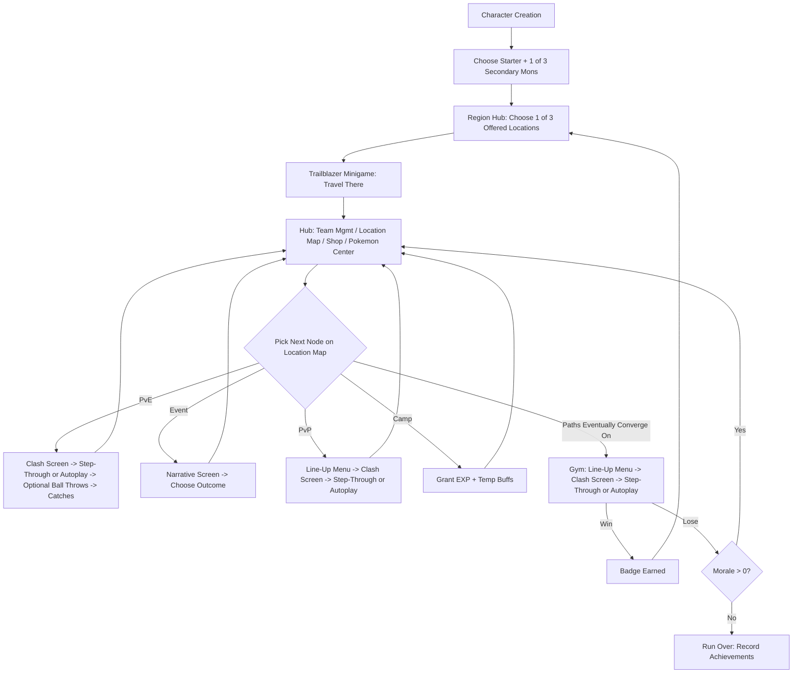

# Working Title: [TBD — "Astromon" mechanics, Pokémon skin]

A single-player roguelite meta-layer (Slay the Spire) wrapped around a collect-and-auto-battle combat layer (Super Auto Pets), themed with Pokémon assets. Playable solo, with an asynchronous PvP node inside each run.

> **Scope note:** This is a personal/friends fan project using Pokémon (Nintendo/Game Freak/Creatures) characters, types, and assets, with no monetization planned. Treat it as private/non-commercial (don't publish widely or monetize it) to stay on the safe side of IP concerns. [PokeAPI](https://pokeapi.co/) is a good source for species base stats, types, evolution chains, and sprites so you don't have to hand-enter that data — check their fair-use guidelines for attribution/caching etiquette.

---

## 1. Concept & Pillars

- **Roguelite exploration:** A generated Region made of chosen Locations (towns, cities, dungeons, caves, forests, seas, plains, deserts, mountains), each ending in a Gym battle. One attempt ("run") at a time, permadeath via a Morale/lives pool.
- **Auto-battle combat:** Pokémon attack automatically in simultaneous Steps — no move selection — with the player able to jump in mid-fight by dragging a Pokéball onto a wild target to attempt a catch (§10.4, §12.1). Every battle can be watched step-by-step or on autoplay, Super Auto Pets style.
- **Collect & grow:** Catch mons from the wild or adopt them at Pokémon Centers, level them via EXP, evolve them, combine duplicates, and gear them with items.
- **Team synergy:** Type-based team bonuses (TFT-style) reward building around 2–4 mons that share a type.
- **Solo or async multiplayer:** The full campaign is playable solo; a PvP node lets you battle another player's saved team without either of you needing to be online at the same time (Super Auto Pets style).

---

## 2. High-Level Run Loop



Every Location's node-map branches through PvE/Event/PvP/Camp nodes but always funnels into a single mandatory **Gym battle** — beat it to earn a badge and unlock your next Location choice.

---

## 3. Character Creation & Starting Roster

1. Player customizes cosmetic appearance.
2. Player receives a starting badge (placeholder relic/cosmetic — see Open Questions) and a fixed or chosen **starter mon**.
3. Player is shown **3 secondary mon options** and picks one.
4. Starter + chosen secondary = your initial **Lead + Support pair** — the two mons you'll actually see in your very first battle.
5. Player arrives at the Region Hub to pick their first Location.

---

## 4. Meta Layer: Regions & Locations

- A **Region** is procedurally generated at run start: a pool of available Locations, each with a terrain type, a difficulty tier, an assigned Gym Leader (whose badge is that Location's clear condition), and a chance of a Legendary encounter.
- **Location types** and the Pokémon types they bias toward (tune freely — this is a starting mapping):

| Location Type | Biased Pokémon Types | Flavor |
|---|---|---|
| Town | Normal, Fairy | Low danger, more Events/Shops, fewer PvE fights |
| City | Normal, Steel, Electric, Psychic | Trainer-heavy, more PvP-flavored fights |
| Dungeon | Ghost, Dark, Poison, Steel | High difficulty, rare loot |
| Cave | Rock, Ground, Poison, Dark | Cramped, ambush-prone |
| Forest | Grass, Bug, Flying | Dense wild encounters |
| Sea | Water, Ice | Coastal/aquatic encounters |
| Plains | Normal, Flying, Grass, Electric | Open, frequent wild encounters |
| Desert | Ground, Fire, Rock | Sparse but tough encounters |
| Mountain | Rock, Ground, Flying, Ice, Fighting | Harsh terrain, strong Gym Leaders |

  Every Location, regardless of type, includes a Pokémon Center (§12.2) — it's a standard option everywhere now, not a Town/City-specific feature.

- Each Location has its own **node-graph map** (Slay the Spire style — branching paths through PvE/Event/PvP/Camp, converging on a mandatory Gym boss node).
- **Morale** = the run's life total. Decrements on a lost battle (Gym or otherwise — TBD exactly which). Hitting 0 ends the run.
- Beating a Location's Gym awards a badge and returns you to the **Region Hub** to pick the next Location.
- Run-ending "finale" condition (fixed number of badges? an Elite-Four/Champion-style capstone Location? endless until Morale runs out?) is intentionally left open — see Open Questions.
- On run end (win or lose), record meta-progression: achievements, badges earned, highest-level/maxed mons, etc. This persists across runs even though the run itself is lost.

---

## 5. Location Node Map

### 5.1 Node Types

| Node | Pre-battle screen | Player interaction during battle | On win | On loss |
|---|---|---|---|---|
| **PvE** | Clash screen (no line-up screen — uses your current lead/support order as-is) | Step-through or autoplay; player may drag Pokéballs onto the enemy Lead between Steps to attempt catches (§12.1) | Any successful catches join your Box | Morale -1 (TBD) |
| **Event** | Narrative screen | Choose an outcome (branching text choice) | EXP / mon / item, per choice | Possible negative outcome, per choice |
| **PvP** | Line-up menu (see opponent's saved team) | Step-through or autoplay; no catching — it's a trainer battle | Bonus EXP + money | Morale -1 (TBD) |
| **Camp** | Special team management screen | N/A | Grants EXP to current mons + a temporary buff for the next fight (e.g., bonus typing, stat boost) | — |
| **Gym** (mandatory finale of every Location) | Line-up menu (see Gym Leader's team, reorder your line-up) | Step-through or autoplay; no catching — it's a trainer battle | Badge (permanent run-wide passive, like a Slay the Spire relic) + money; unlocks next Location choice | Morale -1 (TBD) |

**Design intent:** PvE nodes are the "trash mobs" — fast, low prep, but now with a real skill layer (when to throw a ball). Gym and PvP nodes are the higher-stakes fights, so you get to scout the enemy and rearrange your line-up first, and there's nothing to catch.

### 5.2 The Hub Screens

Two tiers of "hub":
- **Region Hub:** shown between Locations. Presents **3 candidate next Locations**, each previewing its likely Pokémon type pool (§4 table), for the player to choose from — picking one launches the Trailblazer minigame (§6).
- **Location Hub:** a tabbed screen (Team Management / Location Map / Shop / Pokémon Center) used *within* a Location while you work through its node-map toward the Gym. All four tabs are present in every Location now.

---

## 6. Traveling Between Locations: The Trailblazer Minigame

Replaces the old "fly your rocket ship" transition with a short, skippable minigame representing the journey to whichever of the 3 offered Locations the player picked, reskinned per destination terrain.

### Recommended: "Trailblazer" (lane-based obstacle-dodge)

- Your Lead Pokémon visually carries you along a short runner (~10–20 sec).
- Terrain reskins the obstacles: waves & rocks (Sea), boulders & cliffs (Mountain), cacti & heat shimmer (Desert), roots & branches (Forest), stalactites & bats (Cave/Dungeon), carts & crowds (Town/City), tall grass & gusts (Plains).
- Lead's **Speed** stat sets the base pace/difficulty (faster mon = faster, harder, higher-reward run).
- If your Lead's type matches the destination's dominant type (§4 table), you get a bonus lane/shortcut, fewer hazards, or auto-collected bonus loot — a soft reward, never a hard gate, so a run is never blocked by lacking the "right" type.
- Fully skippable / auto-resolvable (rolls an average result) for players who'd rather just keep moving.
- Reward on a good run: bonus money/item, small EXP.

### Alternatives considered

- **Scouting (fog-of-war reveal):** tap tiles on a small grid to reveal hazards vs. treasure before arriving. Simple, but doesn't touch your party's stats at all.
- **Field Guide Dowsing (rhythm/QTE tap-along):** tap-to-the-beat trek; graded taps yield small loot. Fast to build, but more decorative than mechanical.

### Why Trailblazer

It ties directly into stats you already track (Speed, Type), reuses your existing Pokémon sprites as the runner, is cheap to prototype (a lane obstacle-dodge is a well-worn, low-scope pattern), and echoes HM-style traversal from the mainline games — a type match helps you here — without ever hard-blocking a run.

---

## 7. Roster, Box, and Battle Line-Up

- **Box:** your full collection of caught/adopted mons (grows via PvE catches, Event rewards, and Pokémon Center adoptions).
- **Active Line-Up:** an ordered subset of your Box you bring into a fight. Front of the line = **Lead** (currently exchanging attacks). Next = **Support** (queued directly behind it). When the Lead faints, the Support becomes the new Lead, and the next mon in line becomes the new Support — a "train" of mons, generalizing the Lead/Support relationship past just 2.
- **Only the Lead and Support are ever mechanically active.** Both have their own stats and their own independently-charging passive (§10.3) — everyone further back in the line-up is fully dormant (no stats, no charge, no passive) until promoted up to Support.
- For PvE, this line-up is whatever order you last set in Team Management (no extra prompt). For Gym/PvP, you explicitly confirm/reorder it in the Line-Up menu after seeing the opponent.

---

## 8. Roster Scope & Curation

- A full Gen 1 base-form roster (79 species, reference-only) was built out earlier as an idea bank, with stats and a starter pass at passives: `pokemon-gen1-roster-items.xlsx`. Superseded by the locked-in roster below for actual gameplay purposes.
- **Actual starting roster is now locked in:** `pokemon_stats_unique.xlsx` — **183 species spanning Generations 1–3**, including full evolution lines (each stage has its own Attack/HP/Speed, not just the base form) plus a handful of well-known Legendaries folded directly into the list (Mew, Mewtwo, Rayquaza, Ho-Oh, Lugia, Kyogre, Groudon). Per-type coverage (dual-typed mons count toward both types they appear on, which is why the numbers are uneven and add up to more than 183):

  | Type | Count | Type | Count | Type | Count |
  |---|---|---|---|---|---|
  | Ground | 26 | Fighting | 13 | Dark | 9 |
  | Grass | 26 | Bug | 13 | Steel | 9 |
  | Flying | 25 | Normal | 13 | Fairy | 9 |
  | Poison | 25 | Electric | 12 | Ghost | 8 |
  | Water | 20 | Dragon | 11 | Ice | 6 |
  | Fire | 19 | Psychic | 16 | | |
  | Rock | 14 | | | | |

- **Stats are explicit placeholders.** Attack/HP/Speed are given directly per evolution stage in the sheet (not derived from anything) and are called out as very subject to change — treat every number as a first draft to be rebalanced once real battles are played.
- **Abilities are intentionally blank for now** — the sheet's Ability column is empty across all 183 rows; passives will be added later. Whenever they are, they should follow §10.3's framework (triggers when the mon's own charge meter fills, regardless of Lead/Support role) and lean on the Type-flavor seeds in §11 (Fire→burn, Water→shield/heal, Electric→paralyze/speed, and so on).
- **Open assumption:** the 7 Legendaries above are folded into the same flat list/format as everything else here, with no rarity flag. Carrying forward §4's earlier design (Legendaries as ultra-rare, PvE-only, full-party-wipe-risk encounters), this doc still treats those 7 as Legendary-tier unless told otherwise.
- Evolution throughline rule still applies once abilities exist: a passive should persist through a Pokémon's evolutions, with only its magnitude scaling by stage/level, not a different passive per stage.

---

## 9. Pokémon Data Model

```ts
type PokemonType =
  | "Normal" | "Fire" | "Water" | "Electric" | "Grass" | "Ice"
  | "Fighting" | "Poison" | "Ground" | "Flying" | "Psychic" | "Bug"
  | "Rock" | "Ghost" | "Dragon" | "Dark" | "Steel" | "Fairy";

interface PokemonSpecies {
  id: number;              // PokeAPI id, reused directly
  name: string;
  types: [PokemonType] | [PokemonType, PokemonType];
  baseStats: { attack: number; health: number; speed: number };
  passiveId: string;       // triggers whenever this mon's own charge meter fills - see §10.3
  evolvesInto?: { speciesId: number; expThreshold: number };
  spriteUrl: string;
}

interface PokemonInstance {
  instanceId: string;
  speciesId: number;
  nickname?: string;
  level: number;
  exp: number;
  expToNextLevel: number;
  currentStats: { attack: number; health: number; speed: number };
  currentHP: number;
  status?: "poisoned" | "burned" | "paralyzed" | "asleep"; // persistent flag - also read by the catch-chance formula, §12.1
  passiveId: string;        // can differ from species default if item-granted
  equippedItems: ItemInstance[]; // capped slot count, TBD
  caughtWithBallTier: number;
}
```

---

## 10. Battle System

### 10.1 Formation & Succession

Both sides bring an ordered line-up. Only the front two are mechanically active at any time: the **Lead** (exchanging attacks) and the **Support** (queued directly behind it). Both have their own stats and their own independently-charging passive meter (§10.3) — everyone further back is fully dormant until promoted. When the Lead faints, the Support immediately becomes the new Lead, and the next mon in line becomes the new Support.

### 10.2 Steps: Simultaneous Attacks

The battle proceeds as a sequence of discrete **Steps**, matching how Super Auto Pets presents its battles:

- In each Step, the current Lead on each side deals damage to the other side's current Lead **simultaneously** — both take damage from the opposing Attack stat at the same moment. There's no "whoever's faster attacks first" for the basic attack; **Speed doesn't govern this exchange at all.**
- Each Step has an attack-animation duration — a fixed pacing window, not stat-driven. During that window, **all four mons currently in play** (both sides' Lead and Support) tick their own charge meter upward, at a rate based on their individual Speed stat: `charge += speed * stepDuration`.
- If any mon's meter reaches full (`charge >= CHARGE_THRESHOLD`, e.g. 100) during that window, its passive **automatically triggers and resolves before the Step fully concludes** — i.e., before the next Step's attack exchange begins. Its meter then resets and starts filling again, so a long fight can see the same Pokémon's ability go off more than once.
- After any triggered abilities resolve, check for faints from the Step's damage; any fainted Lead is replaced by its Support (promoted to the new Lead, with the next mon in line becoming the new Support) before the next Step begins.
- If two or more meters fill within the same Step, they need a resolution order — proposed default: attacking Leads resolve before waiting Supports, ties within a role broken by Speed. Flagged in Open Questions since it only matters in the occasional simultaneous-fill case.

### 10.3 Passives (type-flavored, meter-triggered)

Every Pokémon — Lead or Support — has exactly one trigger for its passive: **its own charge meter filling** (§10.2). There is no Support-only restriction; a Lead can trigger its own ability mid-exchange just as readily as a Support waiting in the back.

```ts
interface Passive {
  id: string;
  name: string;
  description: string;
  // Fires automatically whenever this mon's own charge meter fills, whether it's
  // currently Lead or Support. Meter resets and starts refilling immediately after.
  apply: (ctx: BattleContext, self: PokemonInstance) => void;
}
```

**Passive theming follows Type**, per §8 and §11 — e.g. Fire mons generally burn something, Water mons generally shield or heal, Electric mons generally paralyze or speed something up, Rock mons generally shield-per-hit (already in your Titanolith card sketch). Hand-author the exact numbers and individual character per Pokémon within that theme.

Items are unaffected by any of this — an equipped item's effect fires on whatever condition it specifies, independent of the mon's Lead/Support role.

### 10.4 Watching a Battle: Step-Through or Autoplay

Every battle — PvE, Gym, and PvP alike — can be watched two ways, matching Super Auto Pets' own battle-replay controls:

- **Step-through:** the player manually advances one Step at a time — useful for reading exactly what happened, and, in PvE, for deciding whether to throw a Pokéball.
- **Autoplay:** Steps advance automatically at a short, watchable pace; the player can drop out of autoplay into step-through at any time.

**Catching (PvE only) happens at Step boundaries.** While stepping through (or with autoplay paused), the player can drag a Pokéball onto the enemy Lead; the catch attempt (§12.1) resolves before the next Step begins — it's just the natural pause point this UI already has, not a special interrupt mechanism.

### 10.5 Determinism & Precomputation

Because a battle is a fixed sequence of discrete Steps rather than a continuous real-time simulation, the whole model is friendlier to precomputation than earlier drafts of this doc assumed:

- **Gym and PvP fights** have no interruption possible (no catching), so the full Step log can be computed up front as `simulateBattle(teamA, teamB, seed) => Step[]` and simply played back — trivially replayable, and exactly what async PvP needs to trust a server-computed result.
- **PvE fights** are computed one Step at a time instead, since a successful catch changes the board and the simulation needs to continue from the new state. Practically: generate Steps on demand as the player advances (by stepping or via autoplay), and re-enter the simulation with the updated team any time a catch succeeds.

---

## 11. Team Type Synergies (TFT-style)

Data-driven thresholds per type present in your active line-up (or full roster — TBD which scope). Example shape, numbers are placeholders to tune:

| Type | 2 mons | 4 mons | 6 mons |
|---|---|---|---|
| Fire | +10% Attack | +25% Attack | +40% Attack, ignite passive |
| Water | +15% Max HP | +30% Max HP | +30% HP, team heal on Lead swap |
| Electric | +10% Speed | +20% Speed | +20% Speed, chance to double-attack |

Initial directional ideas for the rest of the types — these double as the passive-flavor seeds referenced in §8/§10.3:

- **Normal** — a flat, unconditional stat boost to the whole line-up; no niche, just consistent value.
- **Grass** — lifesteal tied to damage dealt.
- **Ice** — chance to freeze/slow on hit, reducing the enemy's charge rate.
- **Fighting** — unconditional Attack boost, plus extra damage through shields at higher counts.
- **Poison** — stacking damage-over-time that gets nastier the longer a fight runs.
- **Ground** — bonus HP plus resistance to the Electric/Poison chip damage those types love to apply.
- **Flying** — bonus to whoever attacks first, or a dodge chance early in the fight.
- **Psychic** — reduce enemy Attack, or start the fight with a charge head start.
- **Bug** — individually weak, but the synergy rewards raw type-count more than any one member's stats.
- **Rock** — the shield-per-hit mechanic already in your card sketch (Titanolith's Stone Blast) is basically this trait already.
- **Ghost** — drain effects, or surviving a fatal hit once per battle.
- **Dragon** — rare (only a couple of families across Gen 1–3), so cheaper thresholds (2/3 instead of 2/4/6) with a bigger payoff that grows the longer the battle runs.
- **Dark** — bonus crit chance or damage when your side is behind on HP/mons remaining.
- **Steel** — flat, unconditional damage reduction.
- **Fairy** — a small team-wide heal or status cleanse whenever a new mon enters as Lead.

---

## 12. Catching, Adoption & Evolution

### 12.1 Catching in the wild (PvE only)

- Pokéballs (and better tiers — Great Ball, Ultra Ball, etc.) are bought at the Shop.
- During a PvE battle, the player can drag a Pokéball from their inventory and drop it onto the enemy's current **Lead** — the only enemy mon actually engaged; Support and further-back enemies aren't valid targets until they themselves become Lead.
- Doing so resolves at the next Step boundary (§10.4) — the fight pauses there for the catch attempt (the classic "will it break free" suspense beat), then automatically resumes into the next Step whether it succeeded or failed.
- **Catch chance** is driven by:
  - **Ball tier** — higher tier = better base odds.
  - **Target's current HP %** — lower HP = better odds (the classic "weaken it first" loop).
  - **Status** — if the target currently has a status condition applied (poisoned, burned, paralyzed, asleep — see the `status` field in §9 and the passives that apply them), catch odds get a meaningful bonus. This makes status-inflicting passives directly useful for catching, not just combat.
  - **Ball tier vs. target level**, as before: a low-tier ball can still succeed on a high-level Pokémon, but yields an under-leveled catch; only higher-tier balls guarantee the target's true level.
- **On success:** the target is removed from the enemy line-up exactly as if it had fainted (their Support steps up, or the fight ends if that was their last mon) and is added to the player's Box.
- **On failure:** the ball is consumed and the fight resumes into the next Step.
- Gym and PvP fights are trainer battles, not wild encounters — no catching there, same as the mainline games.

### 12.2 Adoption at Pokémon Centers

- **Every Location has a Pokémon Center**, as a standard tab in its Location Hub (§5.2) — not restricted to any particular Location type.
- A small rotating selection (proposed: 3) of "rescued" Pokémon are shown looking to be adopted — a curated, no-battle, no-catch-roll acquisition path, refreshing whenever the player (re)visits that Location's hub.
- Proposed: adoption costs money (roughly a mid-tier Pokéball's worth) rather than a Pokéball itself, and the rescued mons on offer lean toward that Location's biased types (§4 table). Exact pricing/refresh cadence is a tuning question — see Open Questions.
- Gives players a second, luck-independent acquisition path alongside catching, available everywhere.

### 12.3 Evolution

- Evolution triggers automatically once a mon crosses its species' EXP/level threshold (reuse real Pokémon evolution chains via PokeAPI, restricted to your curated Gen 1–3 roster).
- **Combine 2 of the same mon** to instantly grant EXP to one of them (consumes the duplicate) — a sacrifice/fusion mechanic for dupes.

---

## 13. Economy, Shop & Items

- **Money** earned from Gym and PvP wins (and possibly Events).
- **Shop** sells Pokéballs and items — mon purchases are now largely superseded by catching (§12.1) and Pokémon Center adoption (§12.2); decide whether the Shop still sells mons directly or drops that in favor of those two paths.
- **Items** modify stats or grant/override a passive; equipped onto a specific mon (slot count TBD). Item effects fire on whatever condition they specify, independent of Lead/Support role (§10.3). "Locking" an item onto a mon protects it from being unequipped/sold accidentally.
- **Camp** node: spend money/time to grant your current mons EXP and a temporary pre-battle buff (e.g., bonus typing, stat boost for the next fight only).

---

## 14. Gyms & Badges

Every Location has exactly one Gym — its mandatory final/boss node. Beating it does two things:
1. Grants a **permanent, run-wide passive bonus** (like a Slay the Spire relic) that applies for the rest of the run.
2. Unlocks the choice of your **next Location** at the Region Hub (shown as 3 options, §5.2).

---

## 15. Morale, Win & Loss

- Morale starts at some fixed value (TBD) and decrements on a lost battle node.
- `Morale <= 0` → run over, "Better luck next time" screen, achievements recorded regardless.
- The run's ultimate win condition (fixed badge count, a Champion/Elite-Four-style capstone Location, or just "keep going until Morale runs out") is open — see Open Questions.

---

## 16. Multiplayer: Asynchronous PvP

Modeled on Super Auto Pets:
1. When a player reaches a PvP node, the client/server pulls a **saved team snapshot** from a matchmaking pool of other players (ideally rating-banded).
2. The deterministic Step-log simulator (§10.5) computes the full fight up front — either server-side (authoritative, safer) or client-side against a signed snapshot — and the client just plays the Steps back, step-through or autoplay.
3. Neither player needs to be online simultaneously; the opponent's snapshot is just their last-submitted line-up + stats.
4. Winner gets bonus EXP/money; consider capping how often a given snapshot can be challenged per day to avoid one player's team becoming a punching bag, and periodically refreshing snapshots as players progress.
5. Backend requirements: user accounts, a snapshot store, a matchmaking query, and the shared battle-sim module (same code as solo mode, called server-side).

---

## 17. Screens / UI Inventory

- Character Creation
- Region Hub / Location Select screen (shows 3 candidate Locations with type previews)
- Trailblazer travel minigame screen
- Location Hub: Team Management / Location Map / Shop / Pokémon Center (tabbed, present in every Location)
- Clash screen (PvE, no line-up step)
- Line-Up menu → Clash screen (Gym, PvP)
- Battle screen — step-through or autoplay (Super Auto Pets style); PvE mode supports dragging Pokéballs onto the enemy Lead between Steps
- Narrative/Event screen
- Camp screen
- Win screen / Lose screen
- Achievements / meta-progression screen
- Pokédex — the whole roster, browsable from the main menu with a Type filter and stat sorts. Not in
  the original inventory; added when the roster went to all 183 species and Character Select was
  narrowed to a startable slice, which left most of the roster otherwise invisible outside a wild
  encounter. See ADR 0004.

---

## 18. Suggested Technical Architecture

- **Frontend:** React + TypeScript.
- **Battle engine:** Isolated, pure, unit-testable core that computes one Step at a time (damage exchange, meter increments, passive triggers, faint/promotion) — see §10.5. Wrap it in two thin runners: a **precomputed Step-log runner** (Gym/PvP — compute the whole fight up front, then play it back) and an **on-demand Step runner** (PvE — compute the next Step only when needed, so a mid-fight catch can change the board before continuing). Both runners call the same underlying Step logic so balance stays consistent between modes.
- **Drag-and-drop catching:** needs pointer/touch event handling for dragging a Pokéball onto the enemy Lead sprite; keep this as a self-contained interaction layer that just calls `attemptCatch()` at the next Step boundary, so it doesn't leak into the battle engine itself.
- **Trailblazer minigame:** A separate, lightweight canvas module with no dependency on the battle engine — build it independently, and stub it (instant average-result roll) until it's ready.
- **State management:** Zustand or Redux for run state (roster, map position, morale, money); keep it serializable so a run can be saved/resumed.
- **Species/type data:** Pull from PokeAPI at build time or via a cached local dataset, filtered down to your curated Gen 1–3 roster (§8).
- **Backend (for PvP/accounts):** Node/Express or serverless functions + Postgres (or Supabase/Firebase) for accounts and PvP snapshots. Not needed for the solo prototype.
- **Repo shape (suggestion):**
  ```
  /src/battle-sim/     pure per-Step logic (damage, meters, passives, faints) + tests
  /src/battle-runner/  precomputed-log runner (Gym/PvP) + on-demand runner (PvE)
  /src/minigame/       Trailblazer canvas module
  /src/data/           curated species, types, passives, items (data, not code)
  /src/state/          run/meta state stores
  /src/ui/             screens & components
  /server/             accounts, PvP matchmaking (later phase)
  ```

---

## 19. Suggested MVP / Build Phases

> **These are the original suggestions, kept for the reasoning behind the ordering. The live
> roadmap and — importantly — the record of what's actually built is [PLAN.md](../PLAN.md) §6,
> whose phases track these but have diverged in practice (see
> [ADR 0002](architecture-decisions/0002-shell-first-deviation.md)). Don't read build status out of
> this section.**

- **Phase 0 (prototype, solo, offline):** One hand-authored Location (e.g., a Forest), your first ~10–15 curated species, PvE + Camp + Shop + basic Step-based battle sim with a handful of type-flavored passives. No evolution, no backend. Catching stubbed as a simple end-of-fight "pick 1 from defeated" rather than the full drag-and-drop system. Trailblazer stubbed as an instant auto-roll.
- **Phase 1:** Add the real Gym/Badge flow, Morale/win-loss loop, evolution, the full drag-and-drop catching system (Step-boundary throws, HP%/status-based odds), Pokémon Center adoption, type synergy bonuses, and the real Trailblazer minigame.
- **Phase 2:** Add Events (narrative branches), multiple Location types, procedural Region generation, the rest of the curated Gen 1–3 roster.
- **Phase 3:** Backend + async PvP (accounts, snapshot matchmaking).
- **Phase 4:** Meta-progression (achievements, run finale/capstone), balance pass, polish.

---

## 20. Open Design Questions (explicitly TBD)

- The run's ultimate win condition: a fixed badge count, a Champion/Elite-Four-style capstone Location, or endless until Morale runs out?
- Should players be able to retreat from a Location before beating its Gym (abandoning progress), and if so, at what cost?
- Exact passive magnitudes for the curated roster — the mechanism (charge meter fills → ability fires, type-flavored) is now fixed, but values are yours to tune.
- Exact type-synergy bonus values and whether synergy counts the full roster or just the active line-up.
- Does *any* lost battle cost Morale, or only certain node types? (As built: every lost fight costs one Morale, and that is the *only* consequence — see the two questions below.)
- **Does damage carry between fights?** As built it does not: every fight starts the line-up at full HP, because nothing heals yet (the Pokémon Center rests but doesn't heal, §5.2) and there's no rule for a fainted mon between nodes. If HP should persist, healing and fainting need designing together with it.
- **What does losing a node's fight actually cost, beyond Morale?** On the branching map (§5) the player has already stepped onto a node by the time its fight happens, and forward edges are the only way out, so as built a loss costs Morale and the run walks on — there is no "retry this node until you win it". The Gym is the exception: it has no forward edges, so losing it offers the fight again. Worth confirming that a lost fight shouldn't also cost something else (money, a mon, a forced detour).
- Resolution order when multiple mons' meters fill within the same Step — proposed default is attacking Leads before waiting Supports, ties broken by Speed; confirm or change.
- Does a promoted Support (now the new Lead) keep its partially-filled charge meter, or reset to 0?
- Can multiple balls be thrown at the same target across one fight (retry after a failed catch), or is it one attempt per encounter?
- Pokémon Center exact economy: adoption cost and refresh cadence per Location visit.
- Does the Shop still sell mons directly, now that catching and Pokémon Center adoption both exist as acquisition paths?
- What does the starting badge actually do, if anything, before you've earned real ones?
- Item equip slot count per mon, and whether items are consumable, permanent, or removable-but-lockable.
- PvP fairness: rating bands, snapshot refresh cadence, daily challenge caps.
